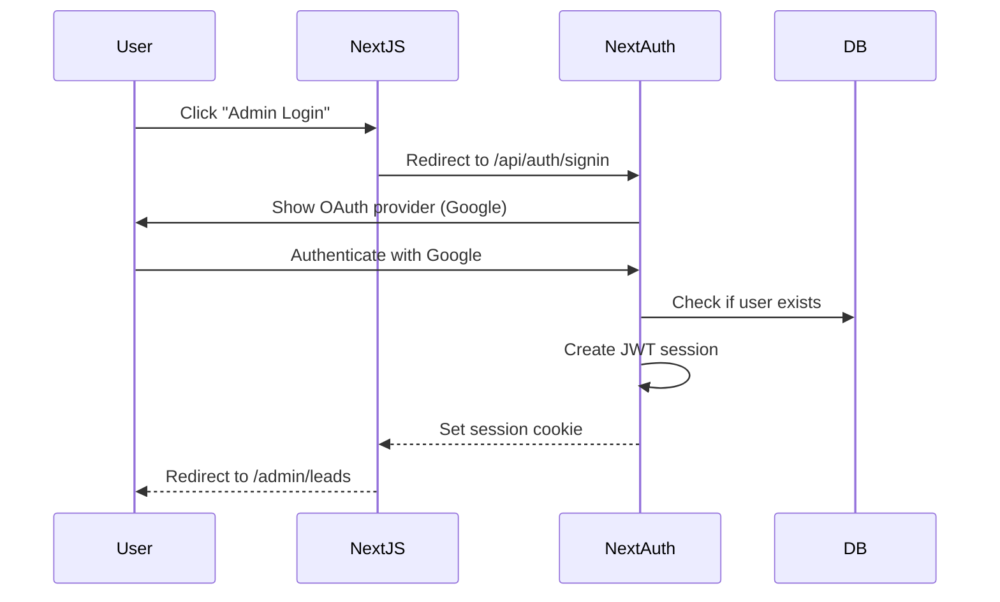

# Backend Architecture

## Service Architecture

### Serverless Architecture

#### Function Organization

```
apps/
├── web/                    # Next.js app with API Routes
│   └── src/
│       └── app/api/
│           └── trpc/[trpc]/route.ts
└── monitoring-bot/         # AWS Lambda functions
    ├── src/
    │   ├── handlers/
    │   │   ├── scrape-reviews.ts       # Main handler
    │   │   ├── scrape-competitors.ts
    │   │   └── analyze-daily.ts
    │   ├── lib/
    │   │   ├── playwright.ts           # Browser setup
    │   │   ├── openai.ts               # AI client
    │   │   └── slack.ts                # Notification
    │   └── utils/
    │       └── scraper-utils.ts
    ├── template.yaml                   # AWS SAM template
    └── package.json
```

#### Function Template

```typescript
// apps/monitoring-bot/src/handlers/scrape-reviews.ts
import { EventBridgeEvent } from 'aws-lambda';
import { chromium } from 'playwright-aws-lambda';
import { db } from '@daedong/db';
import { ecommerceReviews } from '@daedong/db/schema';
import { analyzeReview } from '../lib/openai';
import { sendCrisisAlert } from '../lib/slack';

export const handler = async (event: EventBridgeEvent<'Scheduled Event', {}>) => {
  console.log('Starting review scraping...', { time: event.time });

  const browser = await chromium.launch({ headless: true });
  const page = await browser.newPage();

  try {
    // Scrape Coupang reviews
    await page.goto('https://www.coupang.com/vp/products/12345');

    const reviews = await page.$$eval('.sdp-review__article', (elements) =>
      elements.map((el) => ({
        reviewId: el.getAttribute('data-review-id'),
        author: el.querySelector('.sdp-review__author')?.textContent,
        rating: parseInt(el.querySelector('.sdp-review__rating')?.getAttribute('data-rating') || '0'),
        reviewText: el.querySelector('.sdp-review__text')?.textContent,
      }))
    );

    for (const review of reviews) {
      // Check if already processed
      const existing = await db.query.ecommerceReviews.findFirst({
        where: eq(ecommerceReviews.reviewId, review.reviewId),
      });

      if (existing) continue;

      // Analyze sentiment with AI
      const { sentiment, keywords, isCrisis } = await analyzeReview(review.reviewText);

      // Save to database
      await db.insert(ecommerceReviews).values({
        platform: 'coupang',
        productId: '12345',
        reviewId: review.reviewId,
        author: review.author,
        rating: review.rating,
        reviewText: review.reviewText,
        sentiment,
        keywords,
        isCrisis,
        alertedAt: isCrisis ? new Date() : undefined,
      });

      // Send crisis alert
      if (isCrisis) {
        await sendCrisisAlert({
          platform: 'coupang',
          reviewText: review.reviewText,
          rating: review.rating,
        });
      }
    }

    return {
      statusCode: 200,
      body: JSON.stringify({ processed: reviews.length }),
    };
  } finally {
    await browser.close();
  }
};
```

## Database Architecture

### Schema Design

See **Database Schema** section above for complete SQL schema.

### Data Access Layer

```typescript
// packages/db/src/index.ts
import { drizzle } from 'drizzle-orm/better-sqlite3';
import { drizzle as drizzlePg } from 'drizzle-orm/postgres-js';
import Database from 'better-sqlite3';
import postgres from 'postgres';
import * as schema from './schema';

const isProd = process.env.NODE_ENV === 'production';
const databaseUrl = process.env.DATABASE_URL!;

export const db = isProd
  ? drizzlePg(postgres(databaseUrl), { schema })
  : drizzle(new Database('sqlite.db'), { schema });

// Repository pattern example
export class LeadRepository {
  async create(data: typeof schema.leads.$inferInsert) {
    const [lead] = await db.insert(schema.leads).values(data).returning();
    return lead;
  }

  async findById(id: string) {
    return db.query.leads.findFirst({
      where: eq(schema.leads.id, id),
    });
  }

  async updateStatus(id: string, status: string) {
    const [updated] = await db
      .update(schema.leads)
      .set({ status, updatedAt: new Date() })
      .where(eq(schema.leads.id, id))
      .returning();
    return updated;
  }
}
```

## Authentication and Authorization (Phase 2)

### Auth Flow



### Middleware/Guards

```typescript
// src/server/api/trpc.ts
import { initTRPC, TRPCError } from '@trpc/server';
import { getServerSession } from 'next-auth';

const t = initTRPC.context<Context>().create();

export const publicProcedure = t.procedure;

export const protectedProcedure = t.procedure.use(async ({ ctx, next }) => {
  const session = await getServerSession();

  if (!session || !session.user) {
    throw new TRPCError({ code: 'UNAUTHORIZED' });
  }

  return next({
    ctx: {
      ...ctx,
      session,
      userId: session.user.id,
    },
  });
});
```

---
