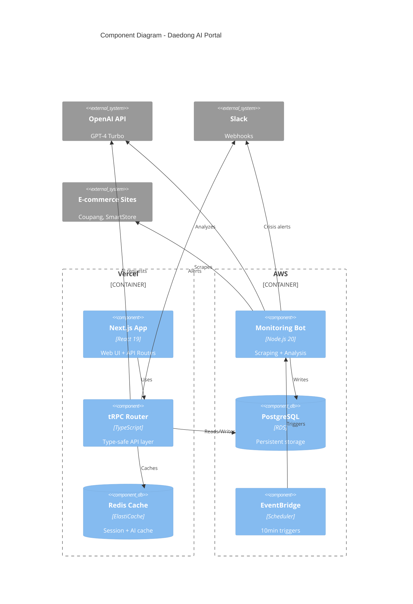

# Components

## Web Application (Next.js)

**Responsibility:** Serves the B2B web portal (Track A), providing AI chatbot, personalization, and quote generation.

**Key Interfaces:**
- `GET /` - Home page with personalized content
- `GET /products` - Product catalog with AI search
- `GET /global-business` - B2B partnership information
- `POST /api/trpc/*` - tRPC API endpoints

**Dependencies:**
- OpenAI API (chatbot)
- PostgreSQL (lead storage)
- Redis (session cache)
- Pinecone (product search)

**Technology Stack:**
- Next.js 15 App Router
- React 19 Server/Client Components
- shadcn/ui + Tailwind CSS
- tRPC client

---

## Monitoring Bot (AWS Lambda)

**Responsibility:** Executes scheduled scraping of e-commerce platforms (Track B), analyzes reviews/inquiries with AI, and triggers alerts.

**Key Interfaces:**
- EventBridge schedule trigger (every 10 minutes)
- Slack Webhook API (alerts)
- PostgreSQL insert (scraped data)
- OpenAI API (sentiment analysis)

**Dependencies:**
- Playwright (scraping)
- PostgreSQL (data storage)
- Slack (notifications)
- OpenAI API (analysis)

**Technology Stack:**
- Node.js 20 Lambda runtime
- Playwright (headless browser)
- BullMQ (job queue - optional for retry logic)
- AWS EventBridge (scheduling)

---

## API Layer (tRPC)

**Responsibility:** Provides type-safe API for frontend, handles business logic, orchestrates AI calls.

**Key Interfaces:**
- `lead.create` - Create new B2B lead
- `chatbot.chat` - Send message to AI chatbot
- `review.getCrisis` - Fetch unresolved crisis reviews
- `inquiry.generateAnswer` - AI-generate CS response

**Dependencies:**
- Drizzle ORM (database access)
- OpenAI/Claude APIs
- Redis (caching)
- Slack (notifications)

**Technology Stack:**
- tRPC v10
- Zod (validation)
- Next.js API Routes

---

## Shared Package (TypeScript Types)

**Responsibility:** Provides shared TypeScript interfaces, constants, and utilities across frontend/backend.

**Key Interfaces:**
- Exports all data model interfaces
- Exports validation schemas (Zod)
- Exports constants (e.g., `PLATFORMS`, `LEAD_STATUSES`)

**Dependencies:** None (pure TypeScript)

**Technology Stack:**
- TypeScript 5.6
- Zod schemas

---

## Component Diagrams

---
