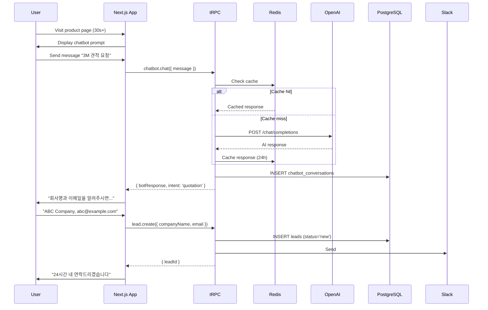
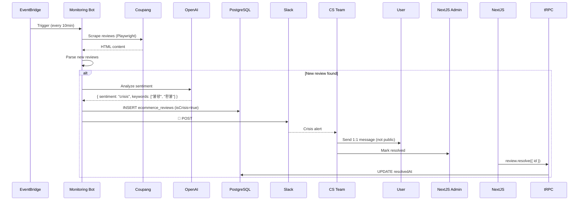
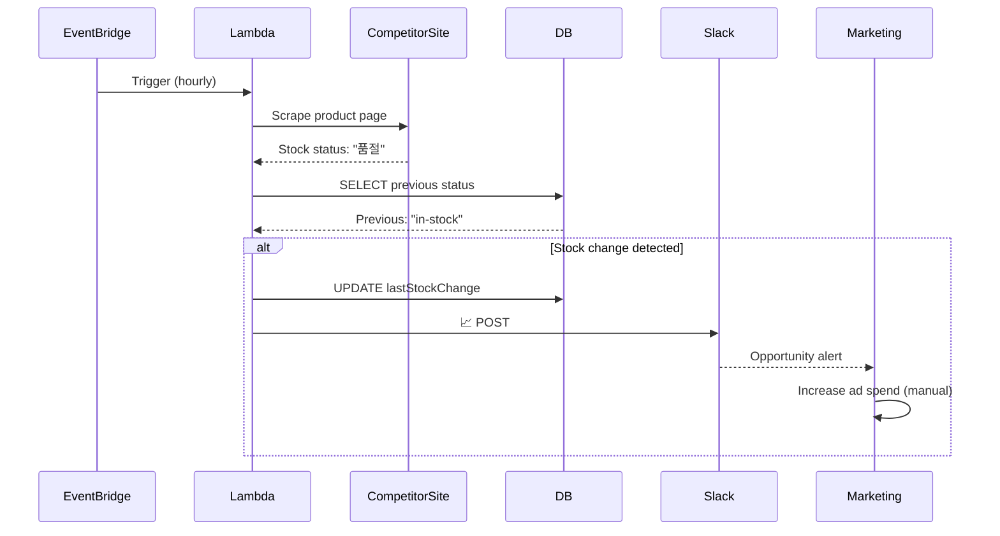

# Core Workflows

## Workflow 1: B2B Lead Capture via Chatbot

```mermaid
sequenceDiagram
    participant User
    participant NextJS as Next.js App
    participant tRPC
    participant Redis
    participant OpenAI
    participant DB as PostgreSQL
    participant Slack

    User->>NextJS: Visit product page (30s+)
    NextJS->>User: Display chatbot prompt
    User->>NextJS: Send message "3M 견적 요청"
    NextJS->>tRPC: chatbot.chat({ message })

    tRPC->>Redis: Check cache
    alt Cache hit
        Redis-->>tRPC: Cached response
    else Cache miss
        tRPC->>OpenAI: POST /chat/completions
        OpenAI-->>tRPC: AI response
        tRPC->>Redis: Cache response (24h)
    end

    tRPC->>DB: INSERT chatbot_conversations
    tRPC-->>NextJS: { botResponse, intent: 'quotation' }
    NextJS->>User: "회사명과 이메일을 알려주시면..."

    User->>NextJS: "ABC Company, abc@example.com"
    NextJS->>tRPC: lead.create({ companyName, email })
    tRPC->>DB: INSERT leads (status='new')
    tRPC->>Slack: Send #sales notification
    tRPC-->>NextJS: { leadId }
    NextJS->>User: "24시간 내 연락드리겠습니다"
```

## Workflow 2: Crisis Review Detection & Response

```mermaid
sequenceDiagram
    participant EventBridge
    participant Lambda as Monitoring Bot
    participant Coupang
    participant OpenAI
    participant DB as PostgreSQL
    participant Slack
    participant CS as CS Team

    EventBridge->>Lambda: Trigger (every 10min)
    Lambda->>Coupang: Scrape reviews (Playwright)
    Coupang-->>Lambda: HTML content
    Lambda->>Lambda: Parse new reviews

    alt New review found
        Lambda->>OpenAI: Analyze sentiment
        OpenAI-->>Lambda: { sentiment: "crisis", keywords: ["불량", "환불"] }
        Lambda->>DB: INSERT ecommerce_reviews (isCrisis=true)
        Lambda->>Slack: 🚨 POST #cs webhook
        Slack-->>CS: Crisis alert
        CS->>User: Send 1:1 message (not public)
        CS->>NextJS Admin: Mark resolved
        NextJS->>tRPC: review.resolve({ id })
        tRPC->>DB: UPDATE resolvedAt
    end
```

## Workflow 3: Competitor Stockout Opportunity

```mermaid
sequenceDiagram
    participant EventBridge
    participant Lambda
    participant CompetitorSite
    participant DB
    participant Slack
    participant Marketing

    EventBridge->>Lambda: Trigger (hourly)
    Lambda->>CompetitorSite: Scrape product page
    CompetitorSite-->>Lambda: Stock status: "품절"
    Lambda->>DB: SELECT previous status
    DB-->>Lambda: Previous: "in-stock"

    alt Stock change detected
        Lambda->>DB: UPDATE lastStockChange
        Lambda->>Slack: 📈 POST #marketing "Competitor X 품절!"
        Slack-->>Marketing: Opportunity alert
        Marketing->>Marketing: Increase ad spend (manual)
    end
```

---
