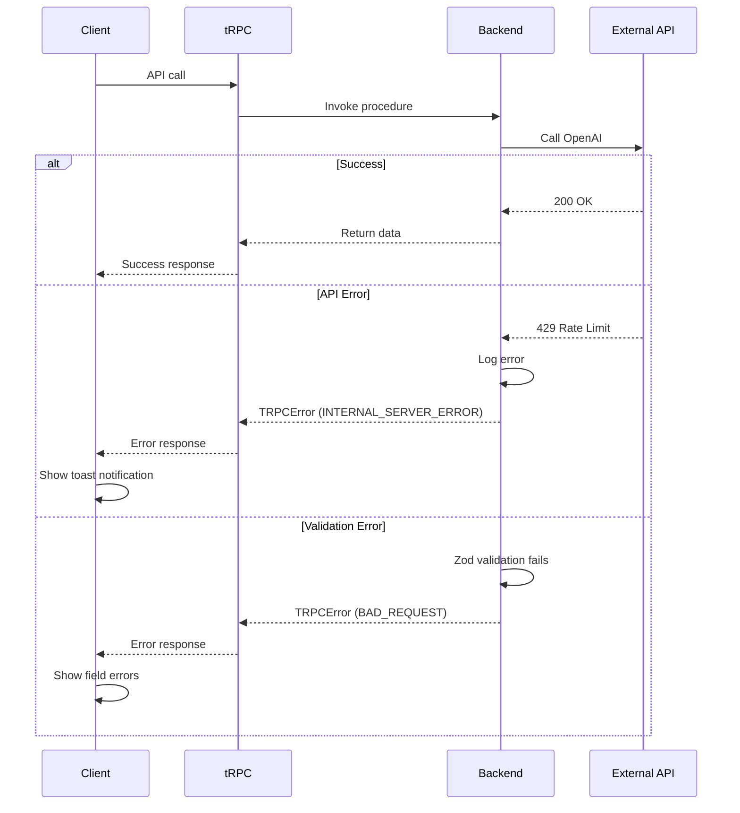

# Error Handling Strategy

## Error Flow



## Error Response Format

```typescript
interface ApiError {
  error: {
    code: string;         // 'UNAUTHORIZED', 'NOT_FOUND', 'INTERNAL_SERVER_ERROR'
    message: string;      // Human-readable error message
    details?: Record<string, any>;  // Additional context
    timestamp: string;    // ISO 8601 timestamp
    requestId: string;    // For tracking in logs
  };
}
```

## Frontend Error Handling

```typescript
// src/lib/trpc/client.ts (tRPC client setup)
export const trpc = createTRPCReact<AppRouter>();

// Component usage
export function QuoteForm() {
  const createLead = trpc.lead.create.useMutation({
    onSuccess: () => {
      toast.success('Quote request submitted!');
    },
    onError: (error) => {
      if (error.data?.code === 'BAD_REQUEST') {
        toast.error(`Invalid input: ${error.message}`);
      } else {
        toast.error('Something went wrong. Please try again.');
        // Log to Sentry
        Sentry.captureException(error);
      }
    },
  });

  // ... form logic
}
```

## Backend Error Handling

```typescript
// src/server/api/routers/lead.ts
export const leadRouter = createTRPCRouter({
  create: publicProcedure
    .input(leadSchema)
    .mutation(async ({ input, ctx }) => {
      try {
        const lead = await ctx.db.insert(leads).values(input).returning();

        // Attempt to send Slack notification
        try {
          await ctx.slack.sendLeadNotification(lead);
        } catch (slackError) {
          // Log but don't fail the request
          console.error('Slack notification failed:', slackError);
          Sentry.captureException(slackError, {
            tags: { service: 'slack' },
            extra: { leadId: lead.id },
          });
        }

        return lead;
      } catch (error) {
        if (error instanceof DatabaseError) {
          throw new TRPCError({
            code: 'INTERNAL_SERVER_ERROR',
            message: 'Failed to create lead. Please try again.',
            cause: error,
          });
        }
        throw error;
      }
    }),
});
```

---
