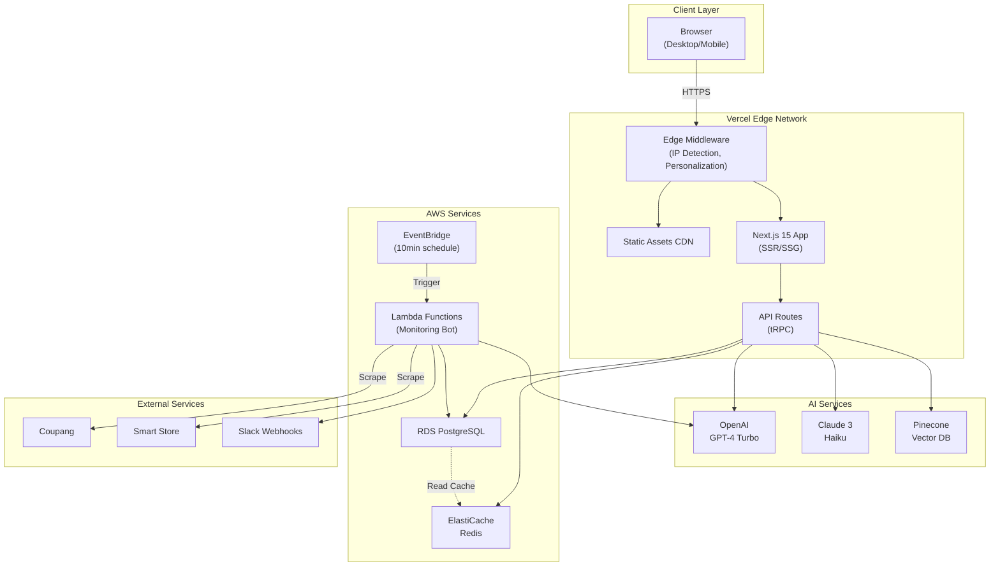

# High Level Architecture

## Technical Summary

The Daedong AI-Powered Business Portal is built as a **modern fullstack serverless application** with a **dual-track architecture**. The system leverages **Next.js 15 App Router** for a unified frontend and API layer, deployed on **Vercel** for automatic scaling and global edge distribution. The backend utilizes a **hybrid serverless approach** with Vercel Functions for API endpoints and **AWS Lambda** for long-running tasks like web scraping.

**Track A (B2B Web Portal)** provides AI-powered lead generation through real-time personalization and intelligent chatbots, while **Track B (E-commerce Monitoring Engine)** automates customer service and competitive analysis through scheduled scraping and AI analysis. Data persistence uses **PostgreSQL** (production) and **SQLite** (local development) via **Drizzle ORM**, with **Redis** for session and response caching. AI capabilities are powered by **OpenAI GPT-4 Turbo** with **Claude 3 Haiku** as fallback, orchestrated through **tRPC** for end-to-end type safety.

This architecture achieves the PRD goals of 24/7 autonomous business operations, 90% CS automation, and sub-1-hour crisis response times through intelligent event-driven workflows and real-time monitoring.

## Platform and Infrastructure Choice

**Platform:** Hybrid (Vercel + AWS)

**Rationale:**
We evaluated three primary options:

1. **Vercel + AWS (Selected)**
   - ✅ Next.js native optimization on Vercel
   - ✅ Serverless Functions for API (10s timeout)
   - ✅ AWS Lambda for long-running tasks (15min timeout)
   - ✅ Best developer experience
   - ⚠️ Multi-platform complexity

2. **AWS Full Stack**
   - ✅ Single platform management
   - ✅ VPC security integration
   - ⚠️ Next.js deployment complexity (Amplify/ECS)
   - ⚠️ Worse DX compared to Vercel

3. **Vercel + Supabase**
   - ✅ Simplest setup
   - ✅ Built-in auth/storage
   - ⚠️ Limited customization for complex workflows
   - ⚠️ No long-running task support

**Selected Platform:** Hybrid (Vercel + AWS)

**Key Services:**
- **Frontend/API:** Vercel (Edge Network, Serverless Functions)
- **Long-running Tasks:** AWS Lambda (EventBridge triggers)
- **Database:** AWS RDS PostgreSQL (production), SQLite (local)
- **Cache:** AWS ElastiCache Redis
- **CDN:** Vercel Edge + CloudFront
- **AI Services:** OpenAI API, Anthropic API
- **Vector DB:** Pinecone (Serverless)
- **Monitoring:** Sentry, Vercel Analytics

**Deployment Host and Regions:**
- **Vercel:** Global Edge Network (automatic)
- **AWS:** ap-northeast-2 (Seoul) primary, ap-northeast-1 (Tokyo) backup

## Repository Structure

**Structure:** Monorepo

**Monorepo Tool:** Turborepo

**Rationale:**
- ✅ Unified codebase for web portal + monitoring bot + shared types
- ✅ Turborepo provides fast incremental builds
- ✅ Shared TypeScript types between frontend/backend via packages
- ✅ Single CI/CD pipeline
- ⚠️ Tradeoff: Initial setup complexity vs long-term maintainability

**Package Organization:**
```
apps/
  web/              # Next.js 15 web application (Track A)
  monitoring-bot/   # AWS Lambda scraping functions (Track B)
packages/
  shared/           # Shared TypeScript types, constants
  ui/               # Shared shadcn/ui components
  db/               # Drizzle ORM schema and migrations
  config/           # ESLint, TypeScript, Tailwind configs
```

## High Level Architecture Diagram



## Architectural Patterns

- **Jamstack Architecture:** Static site generation with serverless APIs - _Rationale:_ Optimal performance and SEO for B2B lead generation while maintaining dynamic AI capabilities
- **Event-Driven Architecture:** Scheduled events trigger monitoring workflows - _Rationale:_ Decouples long-running scraping tasks from user-facing application for reliability
- **Backend for Frontend (BFF):** tRPC provides type-safe API layer - _Rationale:_ Eliminates API contract mismatches and accelerates development with auto-generated types
- **Repository Pattern:** Abstract data access via Drizzle ORM - _Rationale:_ Enables dual database strategy (SQLite/PostgreSQL) with identical codebase
- **Cache-Aside Pattern:** Redis caching for AI responses and session data - _Rationale:_ Reduces AI API costs by 30% and improves response times
- **Component-Based UI:** Reusable React 19 Server/Client Components - _Rationale:_ Leverages React Compiler for automatic optimization and reduces bundle size
- **Dual-Track Isolation:** Separate codepaths for B2B Portal vs E-commerce Engine - _Rationale:_ Independent scaling and deployment of business-critical vs operational workloads

---
